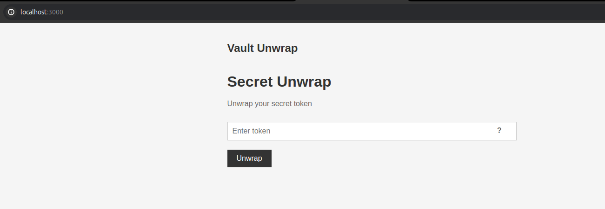
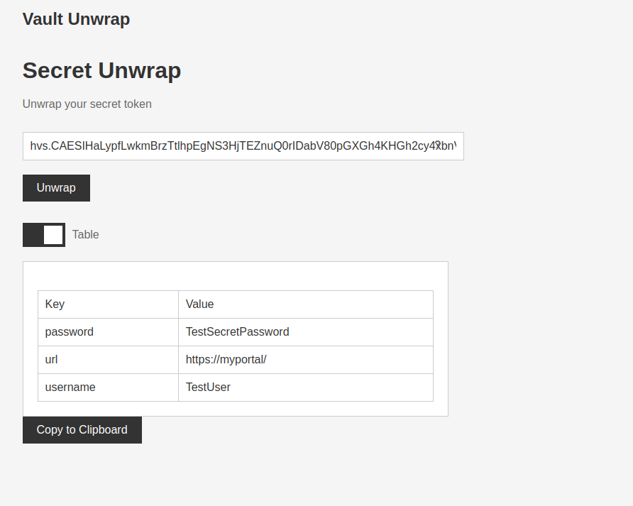
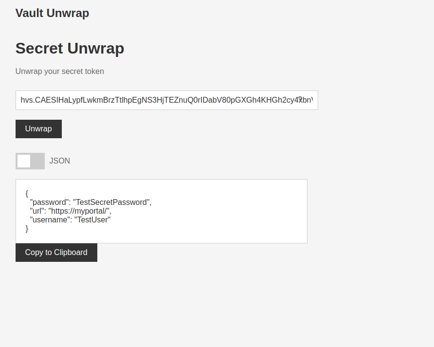

# vault-unwrap-tool
Simple Hashicorp Vault unwrap tool to unwrap tokens without need to autenticate to Vault.

This simple web ui give you ability to unwrap secret without need to autentication with Vault.

Ideal to share secrets with users or outside of organization.

Tool give you also hint how to unwrap secret using cURL command.



## Install

This is node.js application. to run it simply

```
cd web-ui
npm install
node ./app.js
```

## Table view of secret



## JSON view of secret



# About

This tool is experimtal and generated using AI. Use it as template or inspiration. Feel free to modify it.

