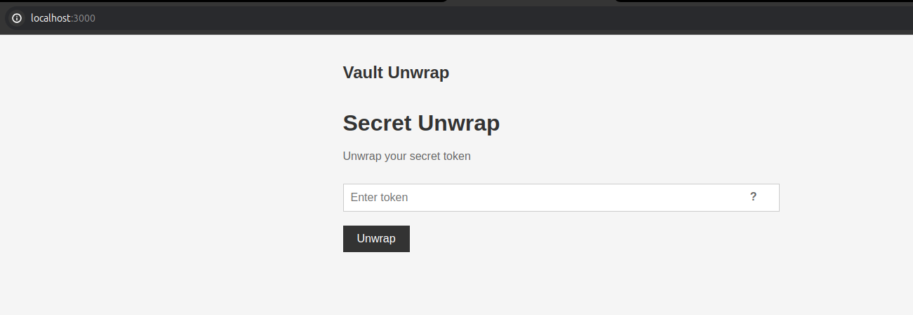
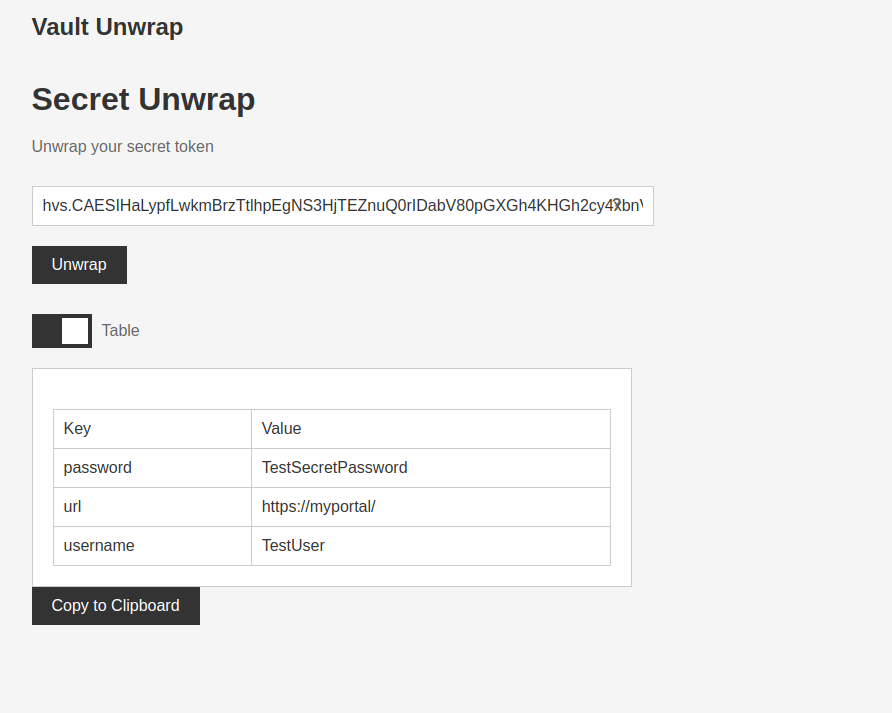
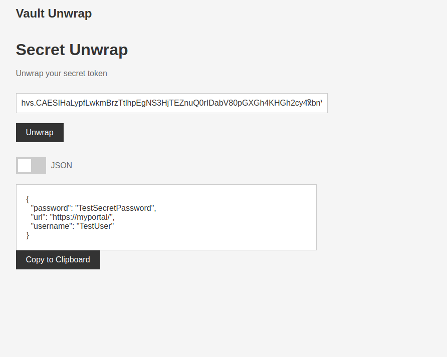

# vault-unwrap-tool
Simple Hashicorp Vault unwrap tool to unwrap tokens without need to autenticate to Vault.

This simple web ui give you ability to unwrap secret without need to autentication with Vault.

Ideal to share secrets with users or outside of organization.

Tool give you also hint how to unwrap secret using cURL command.



## Run locally

This is a node.js application. To run it:

```
cd web-ui
npm install
npm start          # or: node ./app.js
```

The Vault address is read from `VAULT_ADDRESS` if set, otherwise from `config.json`.
The listen port comes from `PORT` or `config.json` (default 3000).

```
VAULT_ADDRESS=https://vault.example.com:8200 PORT=3000 npm start
```

## Deploy to Vercel

The app runs on Vercel as a serverless function (`web-ui/api/unwrap.js`) plus the
static page (`web-ui/public/`). `config.json` is not used on Vercel — set the Vault
address as an environment variable instead.

1. Import the repository in Vercel.
2. Set **Root Directory** to `web-ui`.
3. Add an environment variable: `VAULT_ADDRESS = https://vault.example.com:8200`
4. Deploy.

Or via the CLI:

```
cd web-ui
vercel env add VAULT_ADDRESS    # paste your https Vault address
vercel deploy --prod
```

## Security

This endpoint is intentionally unauthenticated, so it is hardened against abuse:

- **Token validation** — tokens are checked for length and a strict charset
  (`A-Za-z0-9._-`), which also blocks CR/LF header injection.
- **No information leakage** — network/connection errors return a generic message
  so the internal Vault address is never exposed; only Vault's own token errors
  (e.g. "token expired") are passed through.
- **HTTPS enforced** — the configured Vault address must use HTTPS (HTTP is allowed
  only for `localhost` during development).
- **No redirects / timeouts / size caps** — `maxRedirects: 0`, an 8s timeout, and a
  1 MB response cap on the call to Vault.
- **Security headers** — strict CSP (`script-src 'self'`), `X-Frame-Options: DENY`,
  `X-Content-Type-Options: nosniff`, HSTS, and `Referrer-Policy: no-referrer`
  (via `vercel.json` in production and middleware locally).
- **Rate limiting** — a best-effort per-instance limiter is built in. Because
  serverless instances are ephemeral, for real protection enable Vercel's
  platform [rate limiting / WAF](https://vercel.com/docs/security/vercel-waf).

## Table view of secret



## JSON view of secret



# About

This tool is experimtal and generated using AI. Use it as template or inspiration. Feel free to modify it.

